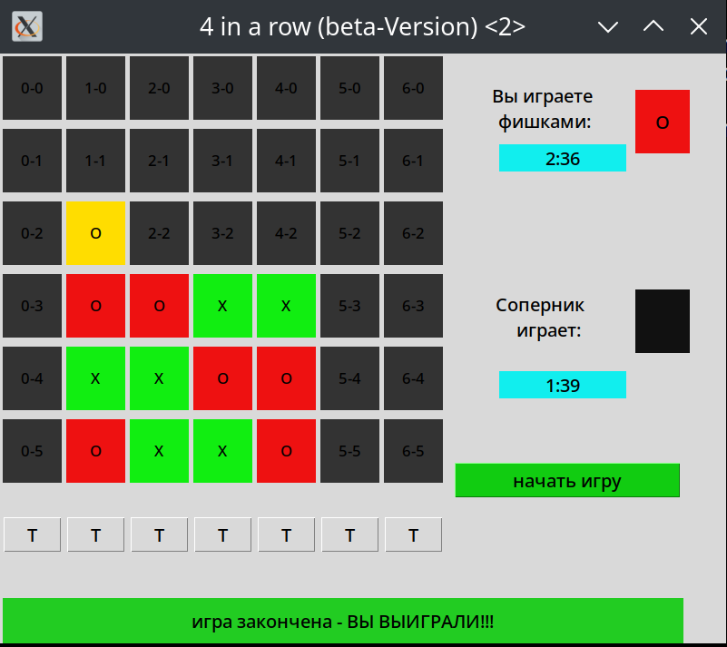
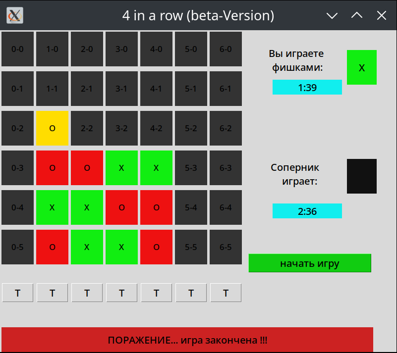
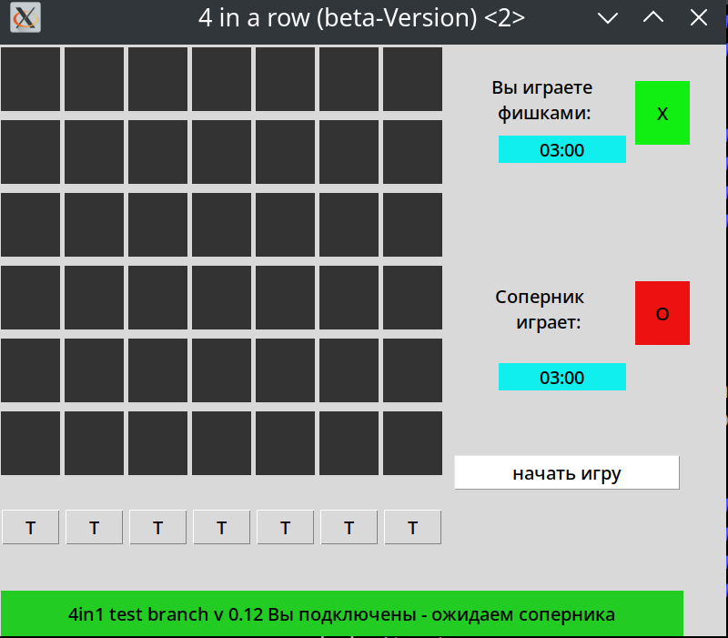
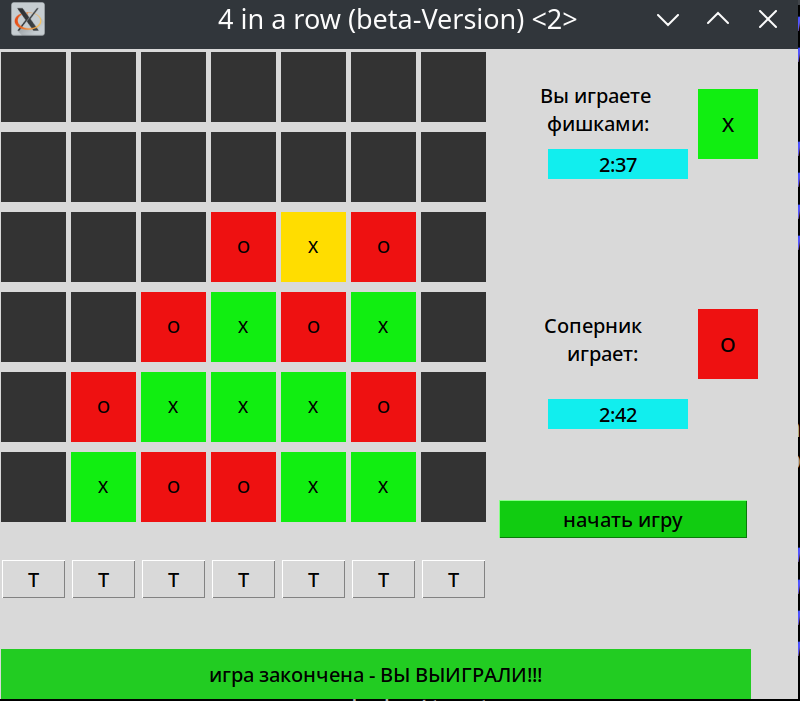

# 🎮 Сетевая игра «4 в ряд»

**Pet-проект**, созданный с целью практики в клиент-серверной архитектуре, 
работе с потоками, графическим интерфейсом (tkinter), а также построении 
простого CI/CD с Jenkins и GitHub Webhooks.

---

##  Кратко о проекте

- **Язык:** Python 3
- **Тип проекта:** Client-Server game (двое игроков по сети)
- **GUI:** Tkinter
- **Протокол связи:** TCP
- **CI/CD:** Jenkins (Freestyle + Pipeline), Webhooks от GitHub
- **Окружения:** Ubuntu (без контейнеризации)
- **Формат:** pet-проект, итеративная доработка в виде «спринтов»

---

## 🧩 Архитектура
<pre> \`\`\`
┌──────────┐ TCP        ┌────────────┐
│ Клиент   │ ◀────────▶ │ Сервер     │
└──────────┘            └────────────┘
▲ ▲
│ │
GUI (Tk) Потоки (_thread)
\`\`\` </pre>

- Клиент отображает игровое поле, принимает ходы игрока и отправляет на сервер
- Сервер управляет состоянием игры, валидирует ходы, синхронизирует клиентов
- Таймер хода реализован в клиенте

---

## 🧪 CI/CD

**Ветки:**

- `main` — рабочая ветка, деплой через Freestyle job
- `test` — среда разработки, деплой через Jenkins Pipeline (Jenkinsfile)

**Интеграция:**
- GitHub Webhooks на push
- Линтинг через `flake8` (в процессе)
- Возможность запуска тестов (в процессе)
- Смена порта между окружениями для изоляции

---

## 📂 Структура репозитория

<pre> \`\`\`
├── 4inR.py # Клиент (основной)
├── 4inRserver.py # Сервер
├── Jenkinsfile # Pipeline для ветки test
├── stoper.sh # Скрипт остановки сервера
├── requirements.txt # Зависимости (пусто, всё в stdlib)
├── README.md # Описание проекта
└── .gitignore
\`\`\` </pre>

> ⚠️ При деплое имена файлов переименовываются в `*_test.py` или `*_main.py` — в зависимости от окружения.

---

## 🔄 Спринты и фичи

| Ветка | Фича              | Статус     |
|-------|-------------------|------------|
| test  | Таймер хода       | ✅ Завершено |
| main  | Слияние с test    | ✅ Актуально |
| test  | исправлен вид поля| ✅ Завершено |

---

## 🧱 Как запустить  локально)
python3 4inRserver.py
python3 4inR.py
в этом случае сервер будет запущен на 127.0.0.1:65434
# Установить tkinter при необходимости
sudo apt install python3-tk

# Запуск сервера
python3 4inRserver_main.py  # или 4inRserver_test.py

# Запуск клиента
python3 4inR_main.py        # или 4inR_test.py

Зависимости из стандартной библиотеки (socket, tkinter, threading, time)

# Игровой процесс выглядит примерно так (ветка main)
- скрин1

- скрин2

- скрин3

# Ветка test
исправлен вид полей
- скрин1

- скрин2

## 📫 Контакты

- **GitHub**: [mntcalm](https://github.com/mntcalm)
- **Email**: [mntcalm@gmail.com](mailto:mntcalm@gmail.com)
- **LinkedIn**: [https://www.linkedin.com/in/oleksandr-dotsenko-037a8037](https://www.linkedin.com/in/oleksandr-dotsenko-037a8037)
